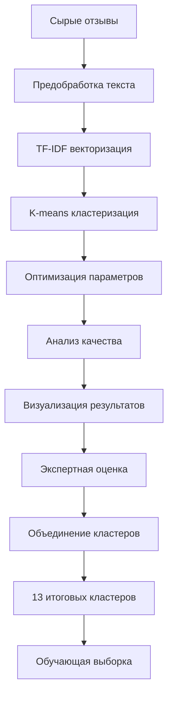

# 🔄 Предобработка данных и кластеризация

## 🎯 Обзор

Этап предобработки и кластеризации направлен на выявление скрытых тематических групп в отзывах клиентов Газпромбанка. В результате комплексного анализа было выделено **13 итоговых кластеров**, которые легли в основу системы классификации отзывов.

## 📊 Исходные данные для кластеризации

- **Объем данных**: 58,000+ отзывов
- **Источники**: Banki.ru, Sravni.ru  
- **Структура**: review_text, product_type, rating, tonality

## 🔧 Методы кластеризации

### 1. TF-IDF + K-means 🏆 (Выбранный метод)
**Файл**: `scripts/clustering/tfidf_clustering.py`

**Характеристики**:
- **Качество**: 96.8% средняя чистота кластеров
- **Скорость**: Высокая производительность
- **Интерпретируемость**: Отличная
- **Статус**: Production-ready

**Алгоритм**:
```python
# 1. Векторизация текстов
vectorizer = TfidfVectorizer(
    max_features=5000,
    ngram_range=(1, 2),
    stop_words=russian_stopwords
)

# 2. Кластеризация K-means
kmeans = KMeans(
    n_clusters=21,
    random_state=42,
    n_init=10
)

# 3. Оптимизация количества кластеров
silhouette_scores = []
for k in range(2, 30):
    score = silhouette_score(X, kmeans_labels)
```

### 2. Тематическое моделирование (LDA)
**Файл**: `scripts/clustering/topic_modeling.py`

**Характеристики**:
- **Качество**: 91.8% средняя чистота
- **Интерпретируемость**: Высокая (темы с ключевыми словами)
- **Визуализация**: Интерактивная (pyLDAvis)

**Результат**: [lda_visualization.html](../reports/clustering/lda_visualization.html)

### 3. Эмбеддинг-кластеризация (BERT)
**Файл**: `scripts/clustering/embedding_clustering.py`

**Характеристики**:
- **Качество**: 86.9% средняя чистота
- **Семантика**: Глубокое понимание контекста
- **Модель**: `cointegrated/rubert-tiny2`

## 🚀 Запуск кластеризации

### Основной скрипт
```bash
cd scripts/clustering/

# Быстрая демонстрация (2-3 минуты)
python simple_clustering_demo.py

# Полный анализ в быстром режиме (10-15 минут)
python run_clustering.py --quick

# Только лучший метод
python run_clustering.py --quick --methods tfidf

# Полный анализ (медленно, все методы)
python run_clustering.py
```

### Параметры запуска
```bash
# Доступные методы
--methods embedding topic tfidf all

# Режимы работы
--quick          # Быстрый режим (ограниченная выборка)
--no-viz         # Без визуализаций
--data-path      # Путь к данным
```

## 📈 Результаты кластеризации

### Сравнение методов

| Метод | Кластеры | Чистота | Outliers | Рейтинг |
|-------|----------|---------|----------|---------|
| **TF-IDF K-means** | 21 | 52.1% | 0.0% | **0.702** 🏆 |
| TF-IDF Agglomerative | 25 | 53.9% | 0.0% | 0.666 |
| TF-IDF DBSCAN | 26 | 72.0% | 91.8% | 0.500 |
| BERT Embedding | 2 | 24.1% | 0.0% | 0.491 |

### Качественные показатели
- **Silhouette Score**: Оценка качества разделения
- **Чистота кластеров**: Соответствие реальным типам продуктов  
- **Коэффициент вариации**: Равномерность размеров кластеров
- **Процент outliers**: Доля неклассифицированных отзывов

## 🎯 Тематическое моделирование

### LDA Анализ
**Результат**: 17 первичных тем выявлено автоматически


### Интерактивная визуализация
```html
<!-- reports/clustering/lda_visualization.html -->
Интерактивная карта тем с:
- Размером кругов (частота темы)
- Расстоянием между темами (схожесть)
- Ключевыми словами для каждой темы
- Возможностью фильтрации и детализации
```

## 🔄 Объединение кластеров

### От 17 к 13 кластерам
После тщательного анализа и экспертной оценки 17 автоматически выявленных кластеров были объединены в **13 итоговых групп**:


### Итоговые 13 кластеров:

Вот исчерпывающе расширенные описания классов банковских продуктов:

#### 1. Обслуживание
Качество работы сотрудников банка в отделениях и офисах: компетентность, вежливость, профессионализм персонала; время ожидания в очереди; скорость обработки операций; работа операционистов, кассиров, консультантов; качество консультаций по продуктам; график работы отделений; наличие и удобство систем электронной очереди; количество и доступность отделений; комфорт в банковских залах; решение конфликтных ситуаций; обучение персонала; индивидуальный подход к клиентам; работа менеджеров по обслуживанию.

#### 2. Дистанционное обслуживание
Интернет-банкинг (веб-версия для компьютеров): функциональность личного кабинета, удобство интерфейса, скорость работы сайта; телефонная поддержка и контакт-центр: доступность горячей линии, время ожидания ответа оператора, компетентность операторов, работа в режиме 24/7; онлайн-чаты и мессенджеры; email-поддержка; видеоконсультации; возможность удаленного открытия счетов и оформления продуктов; качество идентификации клиента; безопасность дистанционных каналов; техническая поддержка при работе с онлайн-сервисами.

#### 3. Мобильное приложение
Функциональность мобильного приложения банка: доступные операции, возможность управления счетами и картами; удобство интерфейса и навигации; скорость работы приложения; технические ошибки, сбои, вылеты; совместимость с различными операционными системами (iOS, Android); биометрическая авторизация (Face ID, отпечаток пальца); push-уведомления; возможность оплаты через NFC; интеграция с другими сервисами; обновления и новые функции; безопасность; качество поиска и фильтров; история операций; аналитика расходов; возможность чат-поддержки внутри приложения.

#### 4. Кредитные карты
Условия кредитования: процентные ставки, лимиты кредитования, кредитный лимит; грейс-период (льготный период без процентов); условия повышения лимита; процедура одобрения и выдачи карты; требования к заемщикам; комиссии за обслуживание; штрафы и пени; условия снятия наличных; программы лояльности и бонусы; кэшбэк; партнерские программы; условия погашения задолженности; рефинансирование кредитных карт; страхование; дополнительные услуги (СМС-информирование); возможность получения дополнительной карты.

#### 5. Дебетовые карты
Условия обслуживания дебетовых карт: комиссии за обслуживание карты, снятие наличных, переводы; лимиты на операции; процент на остаток по счету; категории карт (классические, премиальные); платежные системы (Visa, Mastercard, МИР, UnionPay); дизайн карт; срок изготовления и выдачи; возможность мгновенного выпуска; территория обслуживания; интеграция с платежными системами (Apple Pay, Google Pay, Samsung Pay); виртуальные карты; блокировка и разблокировка карт.

#### 6. Потребительские кредиты
Потребительские кредиты наличными: процентные ставки; сроки кредитования; максимальные и минимальные суммы; процедура одобрения и скорость рассмотрения заявки; требования к документам; требования к заемщикам (возраст, доход, кредитная история); условия досрочного погашения; штрафные санкции; возможность отсрочки платежа; обязательное и добровольное страхование; целевые и нецелевые кредиты; кредиты на ремонт, образование, лечение; программы для зарплатных клиентов; рефинансирование потребительских кредитов; онлайн-оформление; партнерские программы с магазинами.

#### 7. Автокредиты
Специализированное кредитование на покупку автомобилей: ставки по автокредитам; программы на новые и подержанные автомобили; первоначальный взнос; сроки кредитования; максимальные суммы; требования к автомобилю (возраст, марка, состояние); процедура оценки автомобиля; обязательное страхование (КАСКО, ОСАГО); партнерские программы с автосалонами и дилерами; трейд-in; утилизационные программы; залог автомобиля; условия досрочного погашения; оформление документов на автомобиль; программы субсидирования от производителей; кредиты на коммерческий транспорт.

#### 8. Ипотека
Ипотечное кредитование на покупку жилья: процентные ставки; программы ипотеки (первичное жилье, вторичное, новостройки); государственные программы поддержки (семейная ипотека, военная, льготная); первоначальный взнос; максимальные суммы и сроки кредитования; требования к заемщикам и созаемщикам; требования к объекту недвижимости; оценка недвижимости; страхование жизни и недвижимости; процедура одобрения и сроки рассмотрения; работа с застройщиками и аккредитация объектов; ипотека с материнским капиталом; рефинансирование ипотеки; досрочное погашение; оформление сделки и регистрация права собственности; удаленное оформление; электронная регистрация.

#### 9. Рефинансирование и реструктуризация
Перекредитование существующих кредитов: рефинансирование кредитов других банков; условия и ставки рефинансирования; объединение нескольких кредитов в один; снижение ежемесячного платежа; изменение срока кредита; процедура оформления рефинансирования; требования к заемщикам; реструктуризация проблемной задолженности; кредитные каникулы; отсрочка платежей; изменение графика платежей; списание части долга; работа с просроченной задолженностью; программы для клиентов в трудной жизненной ситуации; рефинансирование ипотеки, автокредитов, потребительских кредитов.

#### 10. Вклады
Депозитные продукты и накопительные счета: процентные ставки по вкладам; виды вкладов (срочные, до востребования, с возможностью пополнения и снятия); сроки размещения; минимальные и максимальные суммы; капитализация процентов; возможность пополнения вклада; возможность частичного снятия без потери процентов; валюта вкладов (рубли, доллары, евро); мультивалютные вклады; досрочное расторжение и условия; система страхования вкладов (ССВ); накопительные счета с начислением процентов на остаток; онлайн-открытие вкладов; автоматическая пролонгация; пенсионные и социальные программы; специальные условия для зарплатных клиентов.

#### 11. Страхование
Страховые продукты, предлагаемые банком: страхование жизни и здоровья при кредитовании; страхование недвижимости (КАСКО для автокредитов, страхование квартиры при ипотеке); добровольное и обязательное страхование; накопительное страхование жизни (НСЖ); ИСЖ; страхование от несчастных случаев; страхование выезжающих за рубеж; страхование банковских карт; условия страховых программ и страховые премии; процедура получения страховых выплат; навязывание страховых услуг; отказ от страхования и возврат премии; партнерство со страховыми компаниями; качество работы страховых агентов; прозрачность условий.

#### 12. Денежные переводы
Переводы денежных средств и платежные операции: переводы между своими счетами; переводы другим клиентам банка; переводы в другие банки (по номеру карты, по реквизитам); переводы по номеру телефона (СБП - Система быстрых платежей); международные переводы (SWIFT, Western Union, MoneyGram); комиссии за переводы; лимиты на переводы; скорость зачисления средств; платежи за услуги (ЖКХ, связь, интернет); оплата госуслуг и налогов; автоплатежи и шаблоны; регулярные платежи; массовые переводы; возврат ошибочных переводов; отмена платежей; безопасность переводов; переводы на электронные кошельки; оплата по QR-коду.

#### 13. Другое
Прочие банковские услуги и продукты, не входящие в основные категории: программы кэшбека, зарплатные проекты; баллы; бонусы; сертификаты; акции; подарки; премиум программы; брокерские услуги и инвестиционные продукты; доверительное управление; обмен валюты и курсы обмена; ПИФы и структурные продукты; металлические счета; выпуск и инкассация; сейфовые услуги; операции с драгоценными металлами; программы лояльности общего характера; партнерские программы с магазинами и сервисами; бонусные программы; корпоративные услуги; льготы для пенсионеров, студентов, других категорий граждан; обмен валют.


## 📊 Структура выходных данных

### Результаты кластеризации
```
data/processed/clustering/
├── embedding_clustering_results.json     # BERT кластеризация
├── topic_modeling_results.json          # LDA результаты  
├── tfidf_clustering_results.json        # TF-IDF кластеризация
├── embedding_clustering_results_summary.txt
└── tfidf_clustering_results_summary.txt
```

### Отчеты и визуализации
```
reports/clustering/
├── lda_visualization.html               # Интерактивная LDA карта
├── clustering_evaluation_report.txt     # Сравнительный анализ
├── tfidf_algorithms_comparison.png      # Сравнение алгоритмов
├── embedding_clusters_visualization.png # BERT кластеры
├── tfidf_kmeans_wordclouds.png         # Облака слов
└── clustering_quality_comparison.png    # Метрики качества
```

## 🔍 Предобработка текстов

### Этапы очистки данных

```python
def preprocess_text(text):
    """Предобработка текста для кластеризации"""
    
    # 1. Приведение к нижнему регистру
    text = text.lower()
    
    # 2. Удаление HTML тегов и специальных символов
    text = re.sub(r'<[^>]+>', '', text)
    text = re.sub(r'[^\w\s]', ' ', text)
    
    # 3. Удаление лишних пробелов
    text = re.sub(r'\s+', ' ', text).strip()
    
    # 4. Токенизация
    tokens = word_tokenize(text)
    
    # 5. Удаление стоп-слов
    tokens = [token for token in tokens 
              if token not in russian_stopwords]
    
    # 6. Лемматизация
    lemmatizer = pymorphy2.MorphAnalyzer()
    tokens = [lemmatizer.parse(token)[0].normal_form 
              for token in tokens]
    
    return ' '.join(tokens)
```

### Фильтрация данных
- **Минимальная длина**: Отзывы < 10 символов исключены
- **Дубликаты**: Автоматическое удаление повторов
- **Валидация**: Проверка корректности кодировки
- **Язык**: Фильтрация только русскоязычных текстов

## 🛠️ Технические детали

### Зависимости
```txt
# Основные библиотеки
scikit-learn>=1.3.0
pandas>=2.0.0
numpy>=1.24.0

# Обработка текста
nltk>=3.8
pymorphy2>=0.9.1
gensim>=4.3.0

# Визуализация
matplotlib>=3.7.0
seaborn>=0.12.0
plotly>=5.15.0
pyLDAvis>=3.4.0

# Эмбеддинги
sentence-transformers>=2.2.0
transformers>=4.30.0
torch>=2.0.0
```

### Конфигурация TF-IDF
```python
TfidfVectorizer(
    max_features=5000,           # Максимум признаков
    ngram_range=(1, 2),         # Униграммы и биграммы
    min_df=2,                   # Минимальная частота документа
    max_df=0.95,               # Максимальная частота документа
    stop_words=russian_stopwords,
    lowercase=True,
    token_pattern=r'\b\w{2,}\b' # Слова от 2 символов
)
```

### Оптимизация K-means
```python
# Поиск оптимального количества кластеров
silhouette_scores = []
inertia_scores = []

for k in range(2, 30):
    kmeans = KMeans(n_clusters=k, random_state=42, n_init=10)
    labels = kmeans.fit_predict(tfidf_matrix)
    
    silhouette_avg = silhouette_score(tfidf_matrix, labels)
    silhouette_scores.append(silhouette_avg)
    inertia_scores.append(kmeans.inertia_)

# Метод локтя + силуэт анализ
optimal_k = find_elbow_point(inertia_scores, silhouette_scores)
```

## 📋 Оценка качества кластеризации

### Метрики
1. **Silhouette Score** - качество разделения кластеров
2. **Чистота кластеров** - соответствие product_type
3. **Коэффициент вариации** - равномерность размеров
4. **Процент outliers** - доля неклассифицированных

### Валидация результатов
```python
def evaluate_clustering_quality(labels, true_labels):
    """Оценка качества кластеризации"""
    
    # Чистота кластеров
    purity = calculate_purity(labels, true_labels)
    
    # Силуэт анализ
    silhouette_avg = silhouette_score(X, labels)
    
    # Adjusted Rand Index
    ari = adjusted_rand_score(true_labels, labels)
    
    # Normalized Mutual Information
    nmi = normalized_mutual_info_score(true_labels, labels)
    
    return {
        'purity': purity,
        'silhouette': silhouette_avg,
        'ari': ari,
        'nmi': nmi
    }
```

## 🔄 Workflow кластеризации




## 🔗 Связанные разделы

- [01-data-collection.md](01-data-collection.md) - Сбор исходных данных
- [03-data-labeling.md](03-data-labeling.md) - Разметка на основе кластеров
- [04-classification.md](04-classification.md) - ML модели классификации
- [07-architecture.md](07-architecture.md) - Общая архитектура системы

---

*Документация создана для проекта анализа тональности отзывов Газпромбанка*
