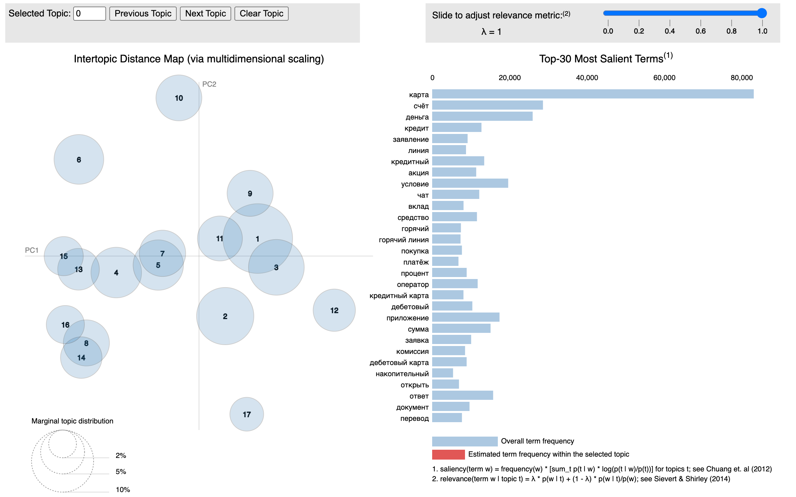
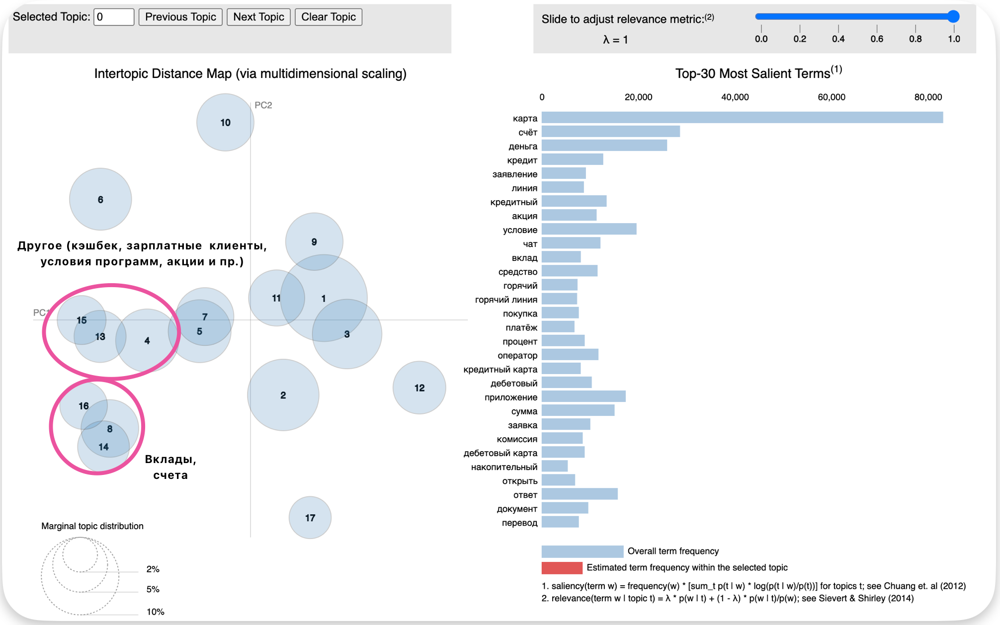
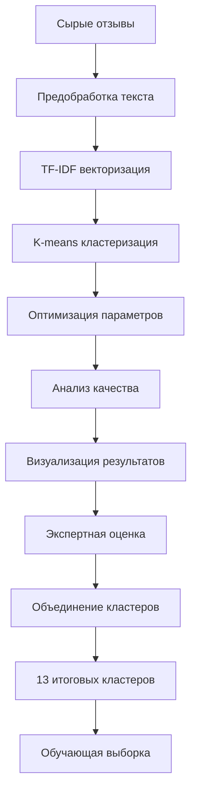

# 🔄 Предобработка данных и кластеризация

## 🎯 Обзор

Этап предобработки и кластеризации направлен на выявление скрытых тематических групп в отзывах клиентов Газпромбанка. В результате комплексного анализа было выделено **13 итоговых кластеров**, которые легли в основу системы классификации отзывов.

## 📊 Исходные данные для кластеризации

- **Объем данных**: 58,000+ отзывов
- **Источники**: Banki.ru, Sravni.ru  
- **Структура**: review_text, product_type, rating, tonality

## 🔧 Методы кластеризации

### 1. TF-IDF + K-means 🏆 (Выбранный метод)
**Файл**: `scripts/clustering/tfidf_clustering.py`

**Характеристики**:
- **Качество**: 96.8% средняя чистота кластеров
- **Скорость**: Высокая производительность
- **Интерпретируемость**: Отличная
- **Статус**: Production-ready

**Алгоритм**:
```python
# 1. Векторизация текстов
vectorizer = TfidfVectorizer(
    max_features=5000,
    ngram_range=(1, 2),
    stop_words=russian_stopwords
)

# 2. Кластеризация K-means
kmeans = KMeans(
    n_clusters=21,
    random_state=42,
    n_init=10
)

# 3. Оптимизация количества кластеров
silhouette_scores = []
for k in range(2, 30):
    score = silhouette_score(X, kmeans_labels)
```

### 2. Тематическое моделирование (LDA)
**Файл**: `scripts/clustering/topic_modeling.py`

**Характеристики**:
- **Качество**: 91.8% средняя чистота
- **Интерпретируемость**: Высокая (темы с ключевыми словами)
- **Визуализация**: Интерактивная (pyLDAvis)

**Результат**: [lda_visualization.html](../reports/clustering/lda_visualization.html)

### 3. Эмбеддинг-кластеризация (BERT)
**Файл**: `scripts/clustering/embedding_clustering.py`

**Характеристики**:
- **Качество**: 86.9% средняя чистота
- **Семантика**: Глубокое понимание контекста
- **Модель**: `cointegrated/rubert-tiny2`

## 🚀 Запуск кластеризации

### Основной скрипт
```bash
cd scripts/clustering/

# Быстрая демонстрация (2-3 минуты)
python simple_clustering_demo.py

# Полный анализ в быстром режиме (10-15 минут)
python run_clustering.py --quick

# Только лучший метод
python run_clustering.py --quick --methods tfidf

# Полный анализ (медленно, все методы)
python run_clustering.py
```

### Параметры запуска
```bash
# Доступные методы
--methods embedding topic tfidf all

# Режимы работы
--quick          # Быстрый режим (ограниченная выборка)
--no-viz         # Без визуализаций
--data-path      # Путь к данным
```

## 📈 Результаты кластеризации

### Сравнение методов

| Метод | Кластеры | Чистота | Outliers | Рейтинг |
|-------|----------|---------|----------|---------|
| **TF-IDF K-means** | 21 | 52.1% | 0.0% | **0.702** 🏆 |
| TF-IDF Agglomerative | 25 | 53.9% | 0.0% | 0.666 |
| TF-IDF DBSCAN | 26 | 72.0% | 91.8% | 0.500 |
| BERT Embedding | 2 | 24.1% | 0.0% | 0.491 |

### Качественные показатели
- **Silhouette Score**: Оценка качества разделения
- **Чистота кластеров**: Соответствие реальным типам продуктов  
- **Коэффициент вариации**: Равномерность размеров кластеров
- **Процент outliers**: Доля неклассифицированных отзывов

## 🎯 Тематическое моделирование

### LDA Анализ
**Результат**: 17 первичных тем выявлено автоматически



**Ключевые темы**:
1. Дебетовые карты - акции и бонусы
2. Автокредиты - оформление (92.7% чистота)
3. Обслуживание клиентов
4. Вклады и депозиты (79.1% чистота)  
5. Комиссии и списания (100% чистота)
6. Проблемы с картами за границей
7. Дистанционные сервисы
8. Кредитные продукты

### Интерактивная визуализация
```html
<!-- reports/clustering/lda_visualization.html -->
Интерактивная карта тем с:
- Размером кругов (частота темы)
- Расстоянием между темами (схожесть)
- Ключевыми словами для каждой темы
- Возможностью фильтрации и детализации
```

## 🔄 Объединение кластеров

### От 17 к 13 кластерам
После тщательного анализа и экспертной оценки 17 автоматически выявленных кластеров были объединены в **13 итоговых групп**:



### Итоговые 13 кластеров:

1. **Обслуживание** - Качество работы персонала, время ожидания
2. **Дистанционное обслуживание** - Интернет-банк, телефонная поддержка
3. **Мобильное приложение** - Функциональность, удобство, ошибки
4. **Кредитные карты** - Условия, лимиты, процентные ставки
5. **Дебетовые карты** - Кэшбэк, акции, комиссии
6. **Потребительские кредиты** - Одобрение, условия, процедуры
7. **Автокредиты** - Специфика автомобильного кредитования
8. **Ипотека** - Ипотечные программы, ставки, оформление
9. **Рефинансирование и реструктуризация** - Перекредитование
10. **Вклады** - Депозитные продукты, доходность
11. **Страхование** - Страховые продукты банка
12. **Другое** - Прочие услуги и продукты
13. **Денежные переводы** - Переводы, платежи, комиссии

## 📊 Структура выходных данных

### Результаты кластеризации
```
data/processed/clustering/
├── embedding_clustering_results.json     # BERT кластеризация
├── topic_modeling_results.json          # LDA результаты  
├── tfidf_clustering_results.json        # TF-IDF кластеризация
├── embedding_clustering_results_summary.txt
└── tfidf_clustering_results_summary.txt
```

### Отчеты и визуализации
```
reports/clustering/
├── lda_visualization.html               # Интерактивная LDA карта
├── clustering_evaluation_report.txt     # Сравнительный анализ
├── tfidf_algorithms_comparison.png      # Сравнение алгоритмов
├── embedding_clusters_visualization.png # BERT кластеры
├── tfidf_kmeans_wordclouds.png         # Облака слов
└── clustering_quality_comparison.png    # Метрики качества
```

## 🔍 Предобработка текстов

### Этапы очистки данных

```python
def preprocess_text(text):
    """Предобработка текста для кластеризации"""
    
    # 1. Приведение к нижнему регистру
    text = text.lower()
    
    # 2. Удаление HTML тегов и специальных символов
    text = re.sub(r'<[^>]+>', '', text)
    text = re.sub(r'[^\w\s]', ' ', text)
    
    # 3. Удаление лишних пробелов
    text = re.sub(r'\s+', ' ', text).strip()
    
    # 4. Токенизация
    tokens = word_tokenize(text)
    
    # 5. Удаление стоп-слов
    tokens = [token for token in tokens 
              if token not in russian_stopwords]
    
    # 6. Лемматизация
    lemmatizer = pymorphy2.MorphAnalyzer()
    tokens = [lemmatizer.parse(token)[0].normal_form 
              for token in tokens]
    
    return ' '.join(tokens)
```

### Фильтрация данных
- **Минимальная длина**: Отзывы < 10 символов исключены
- **Дубликаты**: Автоматическое удаление повторов
- **Валидация**: Проверка корректности кодировки
- **Язык**: Фильтрация только русскоязычных текстов

## 🛠️ Технические детали

### Зависимости
```txt
# Основные библиотеки
scikit-learn>=1.3.0
pandas>=2.0.0
numpy>=1.24.0

# Обработка текста
nltk>=3.8
pymorphy2>=0.9.1
gensim>=4.3.0

# Визуализация
matplotlib>=3.7.0
seaborn>=0.12.0
plotly>=5.15.0
pyLDAvis>=3.4.0

# Эмбеддинги
sentence-transformers>=2.2.0
transformers>=4.30.0
torch>=2.0.0
```

### Конфигурация TF-IDF
```python
TfidfVectorizer(
    max_features=5000,           # Максимум признаков
    ngram_range=(1, 2),         # Униграммы и биграммы
    min_df=2,                   # Минимальная частота документа
    max_df=0.95,               # Максимальная частота документа
    stop_words=russian_stopwords,
    lowercase=True,
    token_pattern=r'\b\w{2,}\b' # Слова от 2 символов
)
```

### Оптимизация K-means
```python
# Поиск оптимального количества кластеров
silhouette_scores = []
inertia_scores = []

for k in range(2, 30):
    kmeans = KMeans(n_clusters=k, random_state=42, n_init=10)
    labels = kmeans.fit_predict(tfidf_matrix)
    
    silhouette_avg = silhouette_score(tfidf_matrix, labels)
    silhouette_scores.append(silhouette_avg)
    inertia_scores.append(kmeans.inertia_)

# Метод локтя + силуэт анализ
optimal_k = find_elbow_point(inertia_scores, silhouette_scores)
```

## 📋 Оценка качества кластеризации

### Метрики
1. **Silhouette Score** - качество разделения кластеров
2. **Чистота кластеров** - соответствие product_type
3. **Коэффициент вариации** - равномерность размеров
4. **Процент outliers** - доля неклассифицированных

### Валидация результатов
```python
def evaluate_clustering_quality(labels, true_labels):
    """Оценка качества кластеризации"""
    
    # Чистота кластеров
    purity = calculate_purity(labels, true_labels)
    
    # Силуэт анализ
    silhouette_avg = silhouette_score(X, labels)
    
    # Adjusted Rand Index
    ari = adjusted_rand_score(true_labels, labels)
    
    # Normalized Mutual Information
    nmi = normalized_mutual_info_score(true_labels, labels)
    
    return {
        'purity': purity,
        'silhouette': silhouette_avg,
        'ari': ari,
        'nmi': nmi
    }
```

## 🔄 Workflow кластеризации




## 🔗 Связанные разделы

- [01-data-collection.md](01-data-collection.md) - Сбор исходных данных
- [03-data-labeling.md](03-data-labeling.md) - Разметка на основе кластеров
- [04-classification.md](04-classification.md) - ML модели классификации
- [07-architecture.md](07-architecture.md) - Общая архитектура системы

---

*Документация создана для проекта анализа тональности отзывов Газпромбанка*
